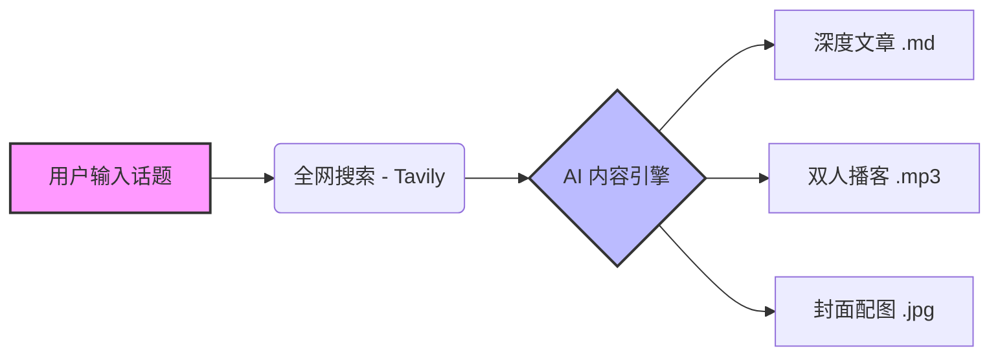

# Ang 🚀

**Ang** 是一个全自动化的 AI 内容创作引擎，旨在让每个人都能成为媒体公司。

只需输入一个话题（例如 "OpenAI Sora" 或 "DeepSeek V3"），Ang 就会自动完成从**信息搜集**、**深度文章撰写**、**双人播客制作**到**封面图设计**的全套工作流。


## ✨ 核心特性

- **🔍 智能搜集 (Search Agent)**
  - 抛弃传统的 RSS 订阅，集成 **Tavily** 搜索引擎，实时抓取全网最新、最相关的一手资讯。 Use AI to search the web.
- **📝 深度写作 (Article Engine)**
  - 内置 Chain-of-Thought (思维链) 写作逻辑，通过 DeepSeek V3 生成有深度、有观点的高质量长文。
- **🎙️ 沉浸式播客 (Podcast Engine)**
  - 自动将新闻转化为生动的双人对谈脚本（Host & Guest）。
  - 集成 **Edge-TTS** 生成逼真语音，并通过 `pydub` 自动进行多音轨拼接与背景音乐 (BGM) 混音。
- **🎨 自动化设计 (Image Engine)**
  - 理解文章内容，自动生成 Prompt，调用 **FLUX.1-schnell** (via SiliconFlow) 绘制高质量封面图。
- **⚡️ 极简体验**
  - 这是一个 CLI 工具，一条命令即可启动全自动流水线。

## 🏗️ 系统架构

Workflow: `Topic Input` -> `Tavily Search` -> `LLM Processing` -> `Multi-Modal Generation`



## 🛠️ 快速开始

### 1. 准备环境

确保已安装 Python 3.8+ 并拥有 `ffmpeg` (用于音频处理)。

**macOS:**

```bash
brew install ffmpeg
```

**Windows:**
请下载 ffmpeg 并将其添加到系统 PATH 中。

### 2. 安装依赖

```bash
git clone https://github.com/your-username/Ang.git
cd Ang
pip install -r requirements.txt
```

### 3. 配置 API Key

在项目根目录创建 `.env` 文件，填入以下必要的 Key：

```ini
# LLM 服务 (推荐 DeepSeek 或其他兼容 OpenAI 接口的服务)
DEEPSEEK_API_KEY=sk-xxxx

# 搜索服务 (Tavily)
TAVILY_API_KEY=tvly-xxxx

# 绘图服务 (SiliconFlow / Flux)
SILICONFLOW_API_KEY=sk-xxxx
```

> **获取方式**:
>
> - [DeepSeek API](https://platform.deepseek.com/)
> - [Tavily Search API](https://tavily.com/) 
> - [SiliconFlow API](https://docs.siliconflow.cn/) 

### 4. 运行

**交互式模式:**

```bash
python main.py
# 按提示输入话题即可
```

**命令行模式:**

```bash
python main.py "英伟达 RTX 5090 发布会"
```

## 📂 输出示例

运行完成后，结果保存在 `output/{timestamp}_{topic}/` 目录下：

```text
output/20260120_103000_DeepSeek_R1/
├── article.md       # 深度分析文章
├── podcast.mp3      # 包含 BGM 的双人对谈音频
├── cover.jpg        # 16:9 封面图
├── script.json      # 播客剧本源文件
└── pipeline.log     # 运行日志
```

## 🧩 项目结构

```
Ang/
├── main.py                 # 程序入口
├── src/
│   ├── article_engine.py   # 文章生成引擎
│   ├── podcast_engine.py   # 播客生成引擎 (脚本+TTS+混音)
│   ├── image_engine.py     # 图像生成引擎 (Prompt+Flux)
│   ├── web_searcher.py     # 搜索模块 (Tavily)
│   ├── tts_engine.py       # 语音合成底层逻辑
│   └── simple_tavily.py    # 便携版 Tavily 客户端
├── assets/                 # 资源文件 (字体、BGM 等)
└── output/                 # 生成结果
```

## 🤝 贡献

欢迎提交 Issue 和 Pull Request！如果你有更好的 Prompt 策略或发现了更有趣的模型玩法，请随时分享。

## 📄 License

MIT License
